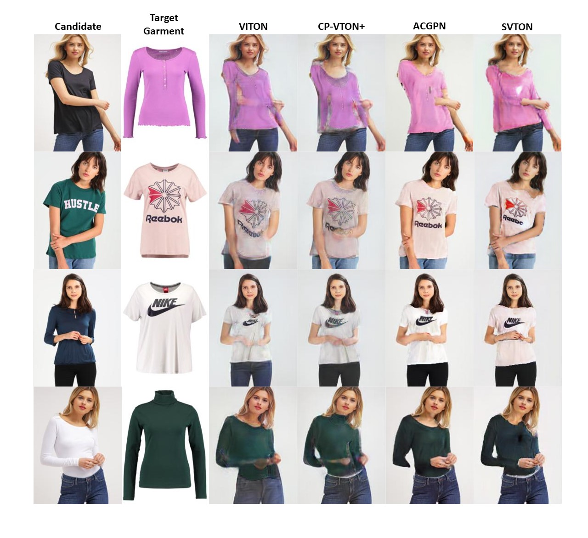

I am currently working towards a PhD in computer science at [Brunel University London](https://www.brunel.ac.uk/).

My thesis focuses on how deep learning-based virtual fitting rooms can support online businesses by enabling customers to interact with clothing products. I have been utilising and developing computer vision and generative AI techniques to minimise the gap between virtual interaction with clothing and real-life experiences.

I am passionate about using my skills to help all types of businesses leverage generative AI to support business functions and make the best use of it.

My latest research
======

<table style="width:100%">
  <tr>
    <th>
      
    </th>
    <th style="text-align:left">
            StyleVTON: A multi-pose virtual try-on with identity and clothing detail preservation 
            Tasin Islam, Alina Miron, XiaoHui Liu and Yongmin Li 
            Neurocomputing, 2024 
            <a href="https://www.sciencedirect.com/science/article/pii/S0925231224006581">paper</a>|<a href="https://github.com/tasinislam21/multi_pose_vton">code</a>
    </th>
  </tr>
  
   

  <tr>
    <th>
      
    </th>
    <th style="text-align:left">
            SVTON: Simplified virtual try-on 
            Tasin Islam, Alina Miron, XiaoHui Liu and Yongmin Li 
            International Conference on Machine Learning and Applications (ICMLA), 2022 
            <a href="https://ieeexplore.ieee.org/abstract/document/10069596">paper</a>|<a href="https://github.com/tasinislam21/SVTON">code</a>
    </th>
  </tr>

</table>

