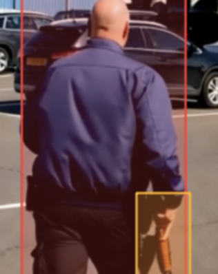
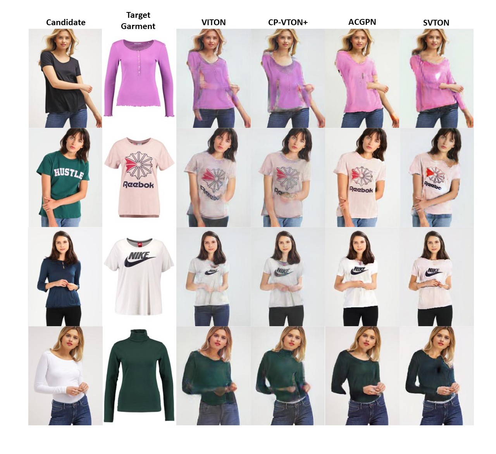

I have a PhD in computer vision and generative AI from [Brunel University London](https://www.brunel.ac.uk/). Currently, I am employed by the Metropolitan Police as a Data Scientist, where I utilise data science techniques to enable the organisation to make data-driven decisions. I have a strong passion for exploring new AI/ML and genAI techniques and how they can be applied in industries. 

My PhD thesis focuses on how deep learning-based virtual fitting rooms can support online businesses by enabling customers to interact with clothing products. I have been utilising and developing computer vision and generative AI techniques to minimise the gap between virtual interaction with clothing and real-life experiences.

I published papers at conferences and journals during my PhD, including MDPI Computers, MDPI Future Internet, Neurocomputing, IEEE Access, and ICMLA. I also have experience in reviewing for IEEE Access and other journals.

My latest work
======

<table style="width:100%">
  <tr>
    <th>
      
    </th>
    <th style="text-align:left">
            Detect firearms using YOLOv11 in LibTorch C++ 
            Tasin Islam, Alina Miron, XiaoHui Liu and Yongmin Li 
            Neurocomputing, 2024 
            <a href="https://medium.com/@tasin17/detect-firearms-using-yolov11-in-libtorch-c-9fe80542d0ab">medium.com</a>|<a href="https://github.com/tasinislam21/gun_detection_python_vs_c_plus">code</a>
    </th>
  </tr>

  

  <tr>
    <th>
      
    </th>
    <th style="text-align:left">
            StyleVTON: A multi-pose virtual try-on with identity and clothing detail preservation 
            Tasin Islam 
            <a href="https://www.sciencedirect.com/science/article/pii/S0925231224006581">paper</a>|<a href="https://github.com/tasinislam21/multi_pose_vton">code</a>
    </th>
  </tr>
  
   

  <tr>
    <th>
      
    </th>
    <th style="text-align:left">
            SVTON: Simplified virtual try-on 
            Tasin Islam, Alina Miron, XiaoHui Liu and Yongmin Li 
            International Conference on Machine Learning and Applications (ICMLA), 2022 
            <a href="https://ieeexplore.ieee.org/abstract/document/10069596">paper</a>|<a href="https://github.com/tasinislam21/SVTON">code</a>
    </th>
  </tr>

</table>

